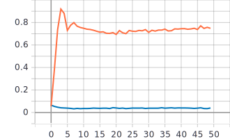

# Лабораторная работа №1.
**Цель лабораторной работы:**
Подготовить работоспособное окружение для решения
задачи классификации изображений из набора данных Food-101 с использованием
нейронных сетей глубокого обучения.

**Задачи:**
1. С использованием примера[1] обучить предоставленную реализацию нейронной
сети для решения задачи классификации изображений Food-101.
2. Создать и обучить сверточную нейронную сеть произвольной архитектуры с
количеством сверточных слоев >3.

## 1. С использованием примера[1] обучить предоставленную реализацию нейронной сети для решения задачи классификации изображений Food-101.
* Архитектура нейронной сети:
  * Входные данные (изображение размером 224x224 пикселя): 
  
  ```inputs = tf.keras.Input(shape=(RESIZE_TO, RESIZE_TO, 3)) // 224x224x3```
  * Сonvolutional 2D слой с параметрами количества фильтров и размера матрицы ядра:

  ```x = tf.keras.layers.Conv2D(filters=8, kernel_size=3)(inputs) // 222x222x8```
  
  * Pooling слой 2x2 с методом выбора максимального значения:

  ```x = tf.keras.layers.MaxPool2D()(x) // 111x111x8```
  
  * Переход из многомерного тензора в одномерный:
  
  ```x = tf.keras.layers.Flatten()(x) // 98568 elements```
  
  * Полносвязный слой, в задачу которого входит классификация. Параметрами заданы количество классов и активационная функция.
  
  ```outputs = tf.keras.layers.Dense(NUM_CLASSES, activation=tf.keras.activations.softmax)(x)```
* Графики обучения представленной нейронной сети:  
   Оранжевая линия: обучение.  
   Синияя линия: валидация.
   * График точности epoch_categorical_accuracy:
   
   
   * График функции потерь epoch_loss:
   
 * Анализ полученных результатов: На графиках видна достаточно большая разница в точности между обучением и валидацией, а именно точность при обучении гораздо больше точности   при  валидации. Из этого следует явное переобучение представленной нейронной сети. Причинами этого может быть архитектура нейронной сети, а также недостаточно большой размер        датасета (101000 изображений на 101 класс).
## 2. Создать и обучить сверточную нейронную сеть произвольной архитектуры с количеством сверточных слоев >3.
